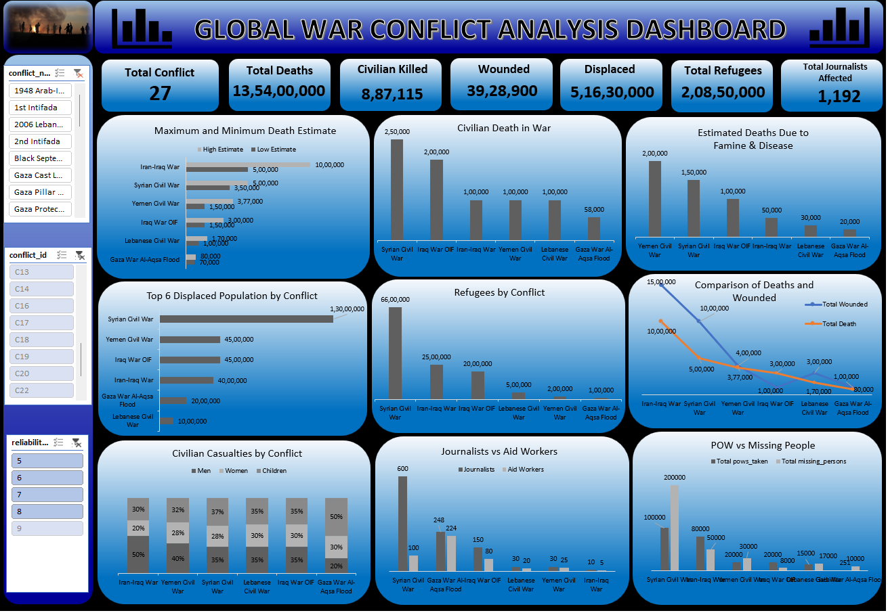

# Global War Conflict Analysis Dashboard

## Project Overview

An interactive Excel dashboard analyzing global war conflicts, casualties, deaths, displacement, refugees, journalists, aid workers, prisoners of war, and missing people.

The dashboard provides a visual analysis of conflict-related human and humanitarian impacts across different conflicts.

## Dashboard Preview

## Tools Used

- Microsoft Excel
- PivotTables
- PivotCharts
- Excel Formulas
- Data Analysis
- Data Visualization
- Interactive Slicers

## Key KPIs

- Total Conflicts: 27
- Total Deaths: 13,540,000
- Civilian Killed: 887,115
- Wounded: 3,928,900
- Displaced: 5,163,000
- Total Refugees: 2,085,000
- Total Journalists Affected: 1,192

## Business Questions

This dashboard helps answer the following questions:

- Which conflicts recorded the highest number of deaths?
- Which conflicts had the highest civilian casualties?
- Which conflicts resulted in the largest displaced populations?
- Which conflicts had the highest refugee populations?
- How do deaths compare with wounded people across conflicts?
- What is the distribution of civilian casualties by men, women, and children?
- How many journalists and aid workers were affected?
- What is the comparison between prisoners of war and missing people?

## Key Analysis

- Maximum and Minimum Death Estimates
- Civilian Deaths by Conflict
- Estimated Deaths Due to Famine & Disease
- Top 6 Displaced Population by Conflict
- Refugees by Conflict
- Comparison of Deaths and Wounded
- Civilian Casualties by Conflict
- Journalists vs Aid Workers
- POW vs Missing People

## Interactive Features

- Conflict Name Filter
- Conflict ID Filter
- Reliability Filter
- Interactive Charts
- KPI Analysis
- Dynamic Dashboard Filtering

## Data Analysis

The dashboard uses Excel-based data analysis techniques to organize and visualize conflict-related humanitarian data.

PivotTables, PivotCharts, formulas, filters, and interactive slicers were used to transform the dataset into an interactive analytical dashboard.

## Project Objective

The objective of this project is to analyze the human and humanitarian impact of global conflicts by examining deaths, civilian casualties, wounded people, displacement, refugees, journalists, aid workers, prisoners of war, and missing people.

## Key Skills Demonstrated

- Excel Dashboard Development
- Data Analysis
- Data Visualization
- PivotTables and PivotCharts
- KPI Development
- Interactive Slicers
- Comparative Analysis
- Business Insights

## Project Files

- `Global_War_Conflict_Analysis_Dashboard.xlsx` — Excel dashboard
- `Global_War_Conflict_Analysis_Dashboard.png` — Dashboard preview
